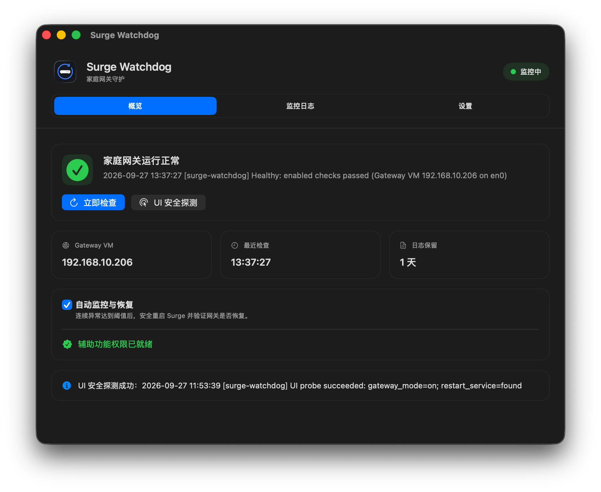
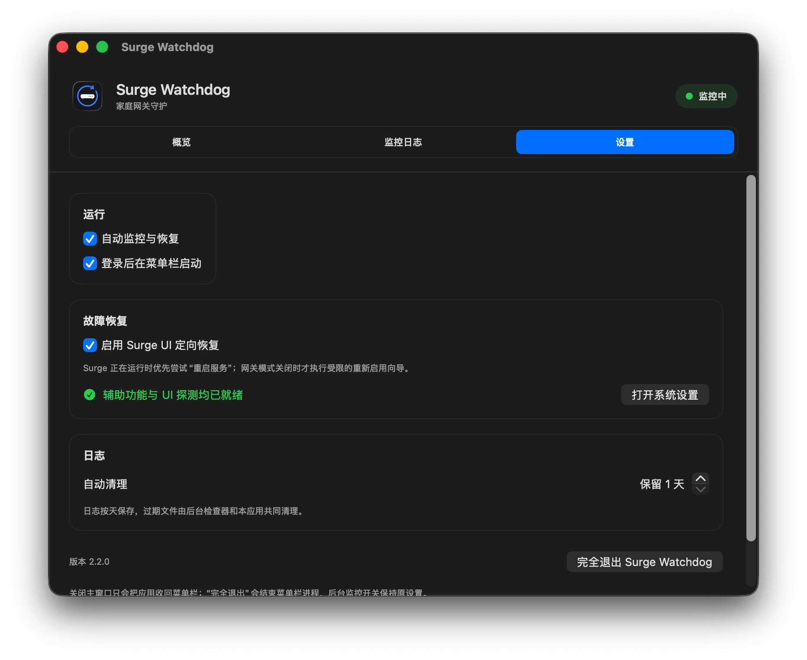

# Surge Watchdog

**Surge 家庭网关的自动故障恢复助手。**

用 Mac 上的 Surge 给家里的设备上网？当 Surge 意外退出或网关服务异常时，Surge Watchdog 会自动尝试恢复，减少你手动打开 Surge、重启服务的次数。

[下载最新版本](https://github.com/deepcoldy/surge-watchdog/releases/latest) · [使用与排障](docs/usage.md) · [开发与构建](docs/development.md) · [反馈问题](https://github.com/deepcoldy/surge-watchdog/issues)

适用环境：**Apple Silicon Mac · macOS 13+ · 已配置好的 Surge 家庭网关**。发行版已通过 Developer ID 签名和 Apple 公证。

## 界面预览

健康状态、网关地址和恢复开关，一屏看清。

查看设置界面：登录启动、UI 定向恢复、日志自动清理

*以上为 2.2.0 界面示例；图中日志保留 1 天是自定义设置，默认保留 7 天。*

## 它能帮你做什么？

| 遇到的情况 | Watchdog 会怎么做 |
| --- | --- |
| Surge 意外退出 | 重新打开 Surge，并检查网关状态 |
| 网关模式已开启，但服务异常 | 优先点击“重启服务”；需要先启用可选的 UI 恢复 |
| 网关模式被关闭 | 尝试通过 Surge 的启用向导恢复；需要先启用 UI 恢复 |
| Gateway VM 的 IP 变化 | 自动发现新地址，无需手动改配置 |

平时常驻菜单栏，可随时查看状态、开始或暂停监控。日志按最新记录优先显示，默认保留 7 天，过期自动清理。

## 如何工作？

启用 **UI 恢复**后，会先尝试重启网关服务或重新开启网关模式；未启用、不可用或恢复失败时，再安全重启整个 Surge。每次恢复后都会重新检查，不把“点击成功”当成恢复成功。

默认两次恢复至少间隔 **120 秒**，每小时最多 **3 次**，避免反复重启。

> 它负责恢复 Surge，**不会自动切换到绕过 Surge 的直连网络**。检查针对本机 Surge、Gateway VM、DHCP 和 DNS；无法修复宽带故障、路由器故障或 Mac 断电。

## 三步开始使用

1. **下载并打开**：在 [Releases](https://github.com/deepcoldy/surge-watchdog/releases/latest) 下载 ZIP，解压后把 `Surge Watchdog.app` 放入“应用程序”或 `~/Applications`，再打开。
2. **安装后台组件**：在“概览”点击“安装后台组件”。无需 Xcode 或命令行操作；后台组件安装不需要管理员权限。
3. **开启监控**：先点击“立即检查”，确认 Surge 网关正常，再开启“自动监控与恢复”。新安装默认暂停监控。

想使用“重启服务”和“重新开启网关模式”？为 **Surge Watchdog** 授予辅助功能权限，在“概览”通过一次 **UI 安全探测**，然后开启 **Surge UI 恢复**。普通检测和重启 Surge 不需要这项权限。

## 常见问题

**会经常弹出 Surge 窗口吗？**

日常检测在后台完成，不操作界面。UI 安全探测或 UI 恢复会打开并操作 Surge；重启整个 App 时也可能显示其窗口。UI 恢复要求当前用户处于已解锁的图形会话。

**关闭窗口或退出应用，就停止监控了吗？**

不会。后台监控独立运行。需要停止自动恢复时，请先关闭“自动监控与恢复”，再退出菜单栏应用。

**会上传我的配置或日志吗？**

不会。没有遥测或日志上传功能；配置和日志保存在本机。项目不操作 UniFi 配置。详见 [安全与隐私](SECURITY.md)。

**如何更新、排障或卸载？**

更新 App 后，在“概览”点击“更新后台组件”。更多操作见 [使用指南](docs/usage.md)；自行构建见 [开发指南](docs/development.md)。

---

独立社区项目，与 Surge 官方无隶属关系。使用前需自行配置好 Surge 网关。本项目不能保证故障恢复一定成功。

[MIT License](LICENSE)
